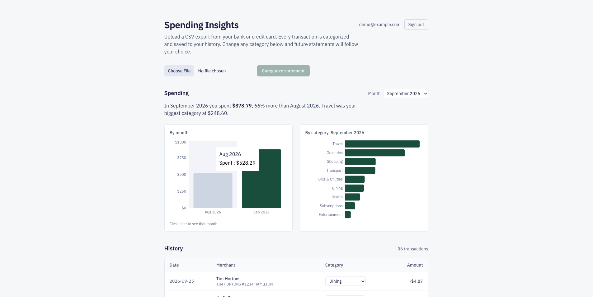
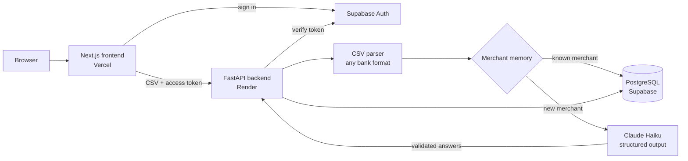

# Spending Insights


Upload a CSV export from any bank or credit card. Every transaction is categorized by an LLM, checked, saved, and turned into a spending dashboard. Categories you correct are remembered, so future statements follow your choices.

**Live demo:** https://spending-insights-omega.vercel.app
Sign in with `demo@example.com` / `Demo123` (read-only account with fake data).
*The backend runs on a free tier and may take up to a minute to wake on the first request.*



## Results

Evaluated on **587 hand-labelled real transactions** over 10 months, using a written [labelling guide](backend/eval/LABELING_GUIDE.md). Labels were assigned without seeing model predictions. The prompt was tuned on the first 7 months only; the last 3 months were held out for reporting.

| Method | Dev (7 months) | Held-out test (3 months) | Sent to the LLM |
|---|---|---|---|
| Keyword rules (baseline) | 71.9% | 59.8% | 0% |
| Claude Haiku | 91.9% | 80.4% | 100% |
| Claude + merchant memory | 91.5% | 81.5% | **41%** |
| Claude + memory + monthly corrections | 93.9% | 85.9% | 40% |

- The LLM beats keyword rules by about **20 points** on unseen months.
- **Merchant memory cuts LLM calls by 59%** with no loss in accuracy.
- Accuracy is lower on recent months because they contain merchants never seen before; user corrections recover most of the gap.
- Claude's confidence is informative: answers with confidence ≥ 0.8 were 93% correct, versus 67% below it. That threshold drives the "Check" flag in the UI and what gets remembered.
- Held-out accuracy varied between 80% and 83% across repeated runs, so differences of 1–2 points are noise.

Full output: [`backend/eval/RESULTS.md`](backend/eval/RESULTS.md). Real transactions never leave my machine; only aggregate numbers are committed.

## How it works



1. **Parse.** One parser handles exports from any bank: it detects the separator, header row, column meanings, date format and sign convention, then converts everything to one format (money out is negative).
2. **Remember.** Each merchant is normalized (store numbers removed) and looked up in the user's merchant memory. Known merchants are categorized instantly at no cost.
3. **Ask the LLM.** New merchants are sent to Claude in batches of 25, as a forced tool call with a fixed JSON schema. Only the description and amount are sent: no dates, names or account numbers.
4. **Verify.** Every answer is validated with Pydantic and must echo the start of its transaction's description, which rejects answers that drift onto the wrong row. Failed rows are retried once, then flagged for review.
5. **Learn.** Confident answers are remembered. A user's correction always overrides the model and is never overwritten.

## Engineering decisions

- **Exact money:** `Decimal` in Python, `numeric(12,2)` in Postgres, integer cents in the dashboard. Never floats.
- **Security:** Supabase Auth; the API derives the user only from a verified token and scopes every query to that user; another user's transaction returns 404, not 403. Row Level Security blocks the public database API. Secret keys live only on the server.
- **Cost controls:** public sign-ups are off, the demo account is read-only, uploads are capped at 1 MB / 500 transactions, and the API account is prepaid with a spending limit.
- **Reliability:** an evaluation run exposed answers occasionally attaching to the wrong row within a batch. Ids plus an echo check plus a retry fixed it, and a regression test keeps it fixed.

## Tech stack

**Frontend:** Next.js, TypeScript, Tailwind CSS, Recharts · **Backend:** Python, FastAPI, Pydantic · **Data:** PostgreSQL (Supabase), Supabase Auth · **AI:** Claude Haiku via the Anthropic API · **Testing:** pytest, GitHub Actions (tests, ESLint, TypeScript) · **Hosting:** Vercel, Render

## Run it locally

<details>
<summary>Setup instructions</summary>

Requirements: Python 3.14, Node 24, a Supabase project, an Anthropic API key.

1. Copy `.env.example` to `.env` and fill in `ANTHROPIC_API_KEY`, `SUPABASE_URL` and `SUPABASE_KEY`.
2. Create `frontend/.env.local` with `NEXT_PUBLIC_API_URL`, `NEXT_PUBLIC_SUPABASE_URL` and `NEXT_PUBLIC_SUPABASE_PUBLISHABLE_KEY`.
3. Install everything and start the app:

```bash
git clone https://github.com/Kmsasaleh/spending-insights.git
cd spending-insights
cp .env.example .env
cd backend && python3 -m venv .venv && source .venv/bin/activate
pip install -r requirements-dev.txt && cd ..
cd frontend && npm install && cd ..
npm install
npm run dev
```

The backend runs on port 8000 and the frontend on port 3000.

**Tests:** `cd backend && pytest` (22 tests, no network or API keys needed).

**Evaluation:** label your own transactions with `python -m eval.make_label_sheet <csv files>`, then run `python -m eval.run_eval`.

</details>

## Limitations and next steps

- European number formats (`4,87`) aren't supported; ambiguous dates like `08/03` are read as month/day.
- Re-uploading the same file creates duplicates; duplicate detection is planned.
- A correction applies to future uploads, not retroactively to older transactions.
- Ideas: subscription detection, budget alerts, PDF statement import.